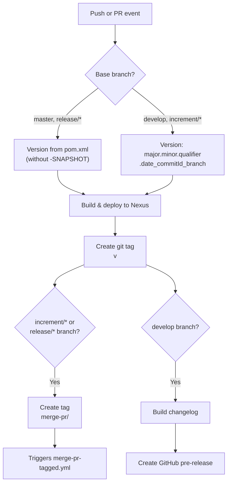
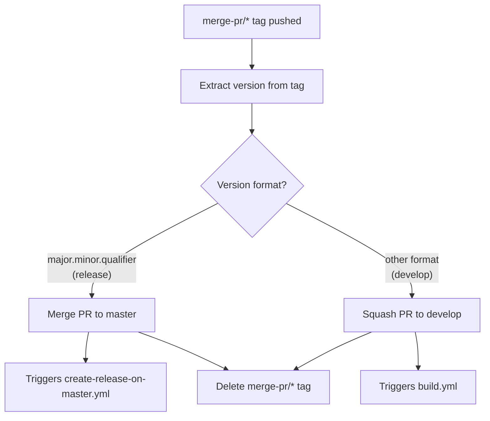
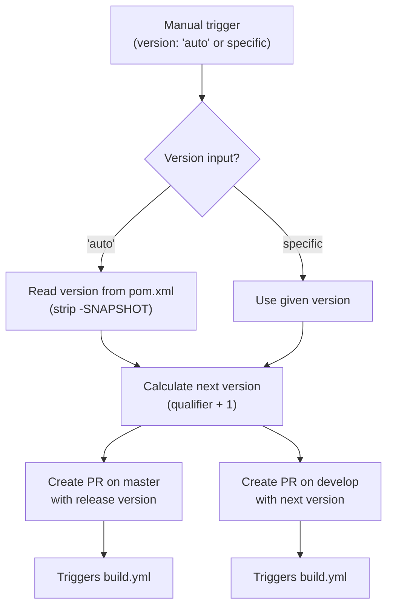

# Development Version and Branch Handling

This document describes the branching strategy, version numbering, and CI/CD pipeline used for JUDO NG modules.

## Branches

The versioning policy follows [GitFlow](https://www.atlassian.com/git/tutorials/comparing-workflows/gitflow-workflow). Each branch type serves a specific purpose in the development lifecycle:

| Branch Pattern | Base Branch | Purpose |
|----------------|-------------|---------|
| `develop` | — | Main development branch with latest sources of the active version |
| `feature/JNG-NNN_summary` | `develop` | New features for the active version |
| `release/X.Y-betaN` | `develop` | Release candidate stabilization (the `release/` prefix is reserved for CI) |
| `bugfix/JNG-NNN_summary` | release branch | Bug fixes applied during release testing; must be merged to all newer release and development branches |
| `support/JNG-NNN_summary` | release branch | Minor updates to a previous release; merged back to release branch when the update ships |
| `master` | — | Latest released (stable) sources of the active version |
| `hotfix/JNG-NNN_summary` | `master` | Emergency fixes applied to both release and master branches |

### Branch Flow

```mermaid
gitGraph
    commit id: "init"
    branch develop
    checkout develop
    commit id: "dev-1"
    branch feature/JNG-1
    commit id: "feat-1"
    commit id: "feat-2"
    checkout develop
    merge feature/JNG-1 id: "merge-feat-1"
    branch feature/JNG-3
    commit id: "feat-3"
    checkout develop
    merge feature/JNG-3 id: "merge-feat-3"
    branch release/1.0-beta1
    commit id: "rc-1"
    branch bugfix/JNG-4
    commit id: "bugfix-1"
    checkout release/1.0-beta1
    merge bugfix/JNG-4 id: "merge-bugfix"
    checkout develop
    merge release/1.0-beta1 id: "merge-release"
    checkout master
    merge release/1.0-beta1 id: "release-1.0"
```

## Version Numbers

Versions follow semantic versioning with specific rules per branch type:

| Event | Version Change |
|-------|---------------|
| Start a `feature/` branch | No version change |
| Start a `release/` branch | Increment 2nd number on `develop` |
| Start a `bugfix/` branch | No version change (fixes go onto the release branch) |
| Start a `support/` branch | Increment 3rd number |
| Start a `hotfix/` branch | Increment 4th number |

On the `develop` branch, versions include a timestamp suffix: `major.minor.qualifier.YYYYMMDD_HHMMSS_commitId_branchName`

On `master` and `release/*` branches, versions use the clean format: `major.minor.qualifier`

## GitHub Actions CI/CD Pipeline

The project uses several interconnected GitHub Actions workflows. Here is how they relate:

### build.yml — Main Build Workflow

Triggered on pushes to `develop` and pull requests to `develop`, `master`, `increment/*`, or `release/*`.



### merge-pr-tagged.yml — PR Merge Automation

Triggered when a `merge-pr/*` tag is pushed. Routes the merge based on version format:



### create-release-on-master.yml — Master Release

Triggered on push to `master`. Creates a GitHub release (marked as "latest") with an auto-generated changelog.

### release.yml — Manual Release Trigger

Manually dispatched workflow that creates release pull requests:



### Supporting Workflows

| Workflow | Purpose |
|----------|---------|
| `build-dependabot.yml` | Runs `mvn clean install` for Dependabot PRs (skips main build) |
| `bump-version.yml` | Updates `pom.xml` version (manual or automated) |
| `create-release-tagged.yml` | Handles releases from version tags |
| `delete-old-draft-releases.yml` | Cleans up stale draft GitHub releases |
| `jira-description-to-pr.yml` | Copies JIRA ticket description into PR body |
| `sync-labels.yml` | Synchronizes GitHub labels across the repository |

## How to Develop

Issue tracking uses [JIRA](https://blackbelt.atlassian.net/jira/dashboards).

> **Important:** There is no commit without a ticket number. Every pull request and commit must include `JNG-xxx` in the message.
