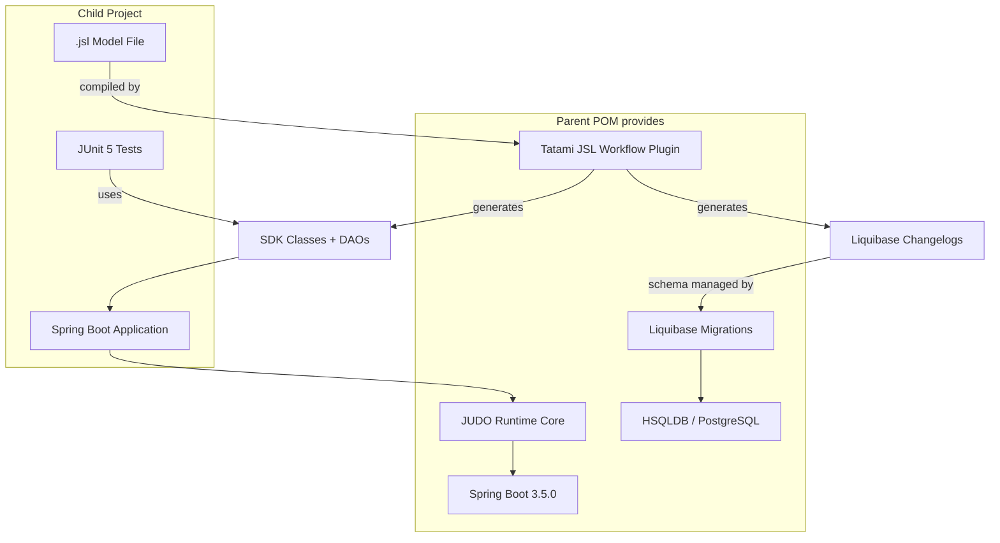
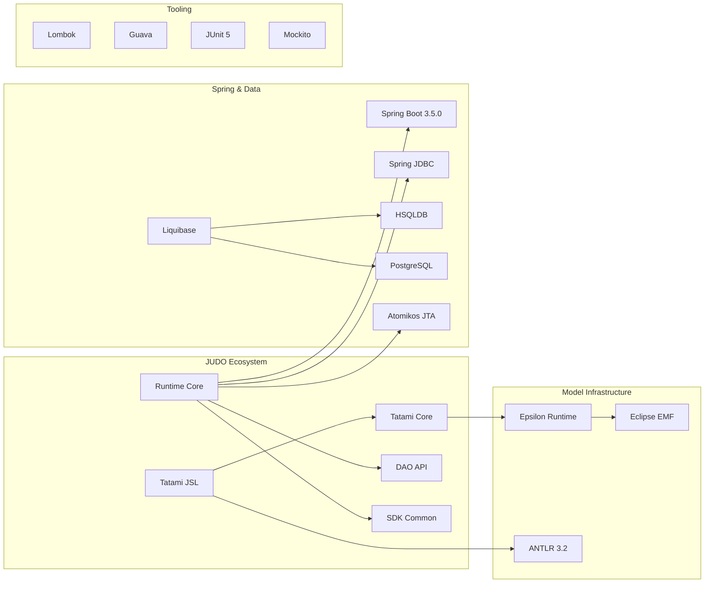

# judo-jsl-springboot-parent

[](https://github.com/BlackBeltTechnology/judo-jsl-springboot-parent/actions/workflows/build.yml)

## Introduction

The `judo-jsl-springboot-parent` project is a Maven parent POM that bundles all essential dependencies needed to bootstrap a JUDO JSL-based Spring Boot application. It is not a standalone application — child projects inherit from it to get a complete, pre-configured build environment with code generation, database support, and runtime integration out of the box.

This project is a building block of the [judo-community](https://github.com/BlackBeltTechnology/judo-community) aggregator project. See that repository for the broader JUDO ecosystem context.

## How It Works

The parent POM provides three things to child projects:

1. **Dependency management** — Spring Boot 3.5.0, JUDO runtime, EMF, Liquibase, HSQLDB/PostgreSQL, and all transitive dependencies with compatible versions locked in
2. **Plugin management** — pre-configured Maven plugins for JSL model compilation, source generation, testing, and packaging
3. **Build lifecycle** — a code generation pipeline that transforms `.jsl` model files into Java SDK classes, DAO interfaces, and Liquibase changelogs

```mermaid
flowchart LR
    JSL["`.jsl` model file"] -->|Tatami JSL plugin| GEN["Generated sources"]
    GEN --> SDK["Java SDK classes"]
    GEN --> LIQ["Liquibase changelogs"]
    GEN --> DAO["DAO interfaces"]
    SDK --> JAR["Spring Boot application"]
    LIQ --> JAR
    DAO --> JAR
```

## Bootstrapping a New Project

### 1. Define a `pom.xml`

Create a `pom.xml` that inherits from this parent. Two properties are mandatory:

| Property | Description |
|----------|-------------|
| `sdkPackagePrefix` | Java package where SDK classes are generated (e.g., `hu.blackbelt.judo.jsl.springboot`) |
| `modelName` | Name of the JSL model — must match the `.jsl` filename and the `model` declaration inside it |

```xml
<project xmlns="http://maven.apache.org/POM/4.0.0"
         xmlns:xsi="http://www.w3.org/2001/XMLSchema-instance"
         xsi:schemaLocation="http://maven.apache.org/POM/4.0.0 http://maven.apache.org/xsd/maven-4.0.0.xsd">
    <modelVersion>4.0.0</modelVersion>

    <parent>
        <groupId>hu.blackbelt.judo.jsl</groupId>
        <artifactId>judo-jsl-springboot</artifactId>
        <version>LATEST</version>
    </parent>

    <groupId>com.example</groupId>
    <artifactId>my-judo-app</artifactId>
    <packaging>jar</packaging>
    <version>1.0.0-SNAPSHOT</version>

    <properties>
        <sdkPackagePrefix>com.example.myapp</sdkPackagePrefix>
        <modelName>MyModel</modelName>
    </properties>

    <build>
        <plugins>
            <plugin>
                <groupId>hu.blackbelt.judo.tatami</groupId>
                <artifactId>judo-tatami-jsl-workflow-maven-plugin</artifactId>
            </plugin>
            <plugin>
                <groupId>org.codehaus.mojo</groupId>
                <artifactId>build-helper-maven-plugin</artifactId>
            </plugin>
        </plugins>
    </build>
</project>
```

### 2. Define a Model

Create `src/main/resources/model/<modelName>.jsl`. The `model` declaration must match `modelName` from your POM:

```
model MyModel;

type string String(min-size = 0, max-size = 128);

entity Person {
    field String firstName;
    field String lastName;
    derived String fullName => self.firstName + " " + self.lastName;
}
```

### 3. Application Configuration

Create `src/main/resources/application.properties`:

```properties
spring.datasource.driver-class-name=org.hsqldb.jdbc.JDBCDriver
spring.datasource.url=jdbc:hsqldb:mem:testdb;DB_CLOSE_DELAY=-1
spring.datasource.username=sa
spring.datasource.password=
spring.liquibase.change-log=classpath:model/MyModel-liquibase_hsqldb.changelog.xml
judo.modelName=MyModel
```

> **Note:** Replace `MyModel` with your actual model name. For PostgreSQL, use the appropriate JDBC driver and `*-liquibase_postgresql.changelog.xml` instead.

### 4. Spring Boot Application Class

Create a `<ModelName>SpringApplication.java` in `src/main/java/<your-package>/`:

```java
package com.example.myapp;

import lombok.extern.slf4j.Slf4j;
import org.springframework.boot.SpringApplication;
import org.springframework.boot.autoconfigure.SpringBootApplication;
import org.springframework.boot.context.event.ApplicationReadyEvent;
import org.springframework.context.event.EventListener;

@SpringBootApplication
@Slf4j
public class MyModelSpringApplication {

    public static void main(String[] args) {
        SpringApplication.run(MyModelSpringApplication.class, args);
    }

    @EventListener(ApplicationReadyEvent.class)
    public void ready() {
        log.info("Application ready");
    }
}
```

### 5. Tests

Create `<ModelName>SpringApplicationTest.java` in `src/test/java/<your-package>/`:

```java
package com.example.myapp;

import com.example.myapp.mymodel.sdk.mymodel.mymodel.Person;
import org.junit.jupiter.api.Test;
import org.springframework.beans.factory.annotation.Autowired;
import org.springframework.boot.test.context.SpringBootTest;

import java.util.Optional;

import static org.junit.jupiter.api.Assertions.assertEquals;

@SpringBootTest
class MyModelSpringApplicationTests {

    @Autowired
    Person.PersonDao personDao;

    @Test
    void testDaoFunctions() {
        Person createdPerson = personDao.create(Person.builder()
                .withFirstName("FirstName")
                .withLastName("LastName")
                .build());

        assertEquals(Optional.of("FirstName"), createdPerson.getFirstName());
        assertEquals(Optional.of("LastName"), createdPerson.getLastName());
        assertEquals(Optional.of("FirstName LastName"), createdPerson.getFullName());
    }
}
```

## Architecture Overview



## Dependency Graph



## Contributing

Everyone is welcome to contribute to JUDO! See [CONTRIBUTING.md](CONTRIBUTING.md) for details.

## License

This project is licensed under the [Eclipse Public License - v 2.0](https://www.eclipse.org/legal/epl-2.0/).
